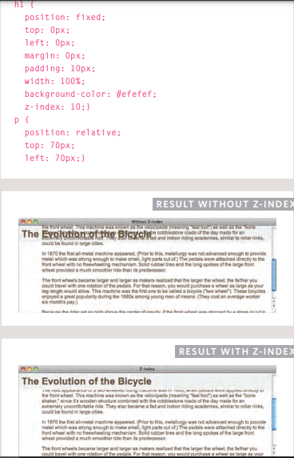
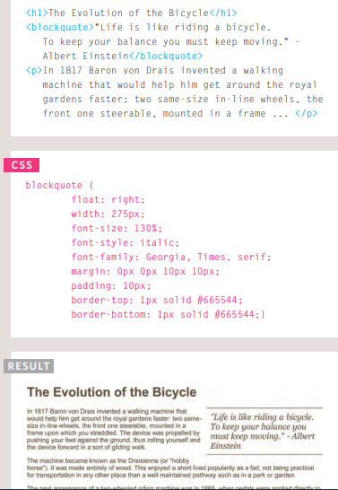
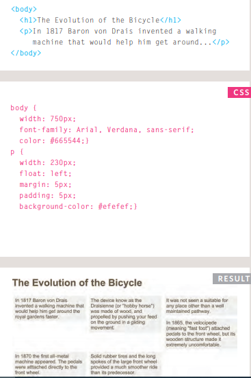
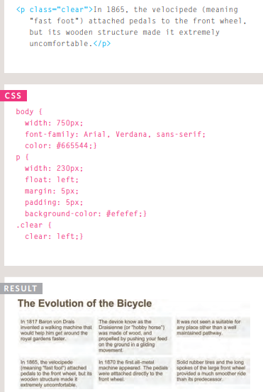
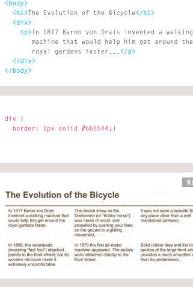
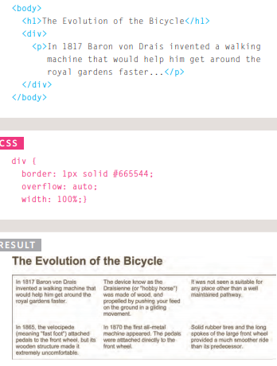
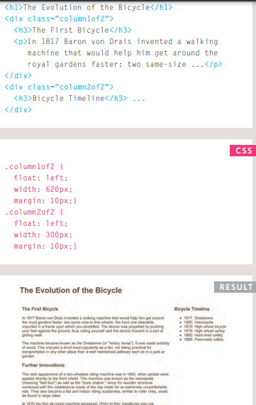

# Normal Flow
* position:static
* In normal flow, each block-level element sits on top of the next one
* do not need a CSS property to indicate that elements should appear in normal flow, but the syntax would be: position: static; 

# Relative Positioning
* position:relative
* Relative positioning moves an element in relation to where it would have been in normal flow
* You can indicate that an element should be relatively positioned using the position property with a value of relative.
* You then use the offset properties (top or bottom and left or right) to indicate how far to move the element from where it would have been in normal flow
* To move the box up or down, you can use either the top or bottom properties.

# Absolute Positioning
* position:absolute
* When the position property is given a value of absolute, the box is taken out of normal flow and no longer affects the position of other elements on the page. 
* The box offset properties (top or bottom and left or right) specify where the element should appear in relation to its containing element
# Fixed Positioning
* Fixed positioning is a type of absolute positioning that requires the position property to have a value of fixed.
* It positions the element in relation to the browser window. Therefore, when a user scrolls down the page, it stays in the exact same place. It is a good idea to try this example in your browser to see the effect.

# Overlapping Elements
* z-index
* When you use relative, fixed, or absolute positioning, boxes can overlap. If boxes do overlap, the elements that appear later in the HTML code sit on top of those that are earlier in the page. 
* If you want to control which element sits on top, you can use the z-index property. Its value is a number, and the higher the number the closer that element is to the front. For example, an element with a z-index of 10 will appear over the top of one with a z-index of 5.

# Floating Elements
* float
* The float property allows you to take an element in normal flow and place it as far to the left or right of the containing element as possible.
* Anything else that sits inside the containing element will flow around the element that is floated.
* When you use the float property, you should also use the width property to indicate how wide the floated element should be

# Using Float to Place Elements Side-by-Side

# Clearing Floats
* clear
* The clear property allows you to say that no element (within the same containing element) should touch the left or righthand sides of a box. 
* It can take the following values:
  - left
    - The left-hand side of the box should not touch any other elements appearing in the same containing element.
  - right
    - The right-hand side of the box will not touch elements appearing in the same containing element.
  - both
    - Neither the left nor right-hand sides of the box will touch elements appearing in the same containing element.
  - none
    - Elements can touch either side

# Parents of Floated Elements: Problem

# Parents of Floated Elements: Solution

# Creating Multi-Column Layouts with Floats
* Many web pages use multiple columns in their design. 
* This is achieved by using a < div> element to represent each column. 
* The following three CSS
properties are used to position
the columns next to each other:
  - width
    - This sets the width of the columns.
  - float
    - This positions the columns next to each other.
  - margin
    - This creates a gap between the columns.

# Screen Resolution
* Resolution refers to the number of dots a screen shows per inch. Some devices have a higher resolution than desktop computers and most operating systems allow users to adjust the resolution of their screens

    

_________________
_________________
