# Form Controls
* several types of form controls that you can use to collect information from visitors to your site.
  - ADDING TEXT
  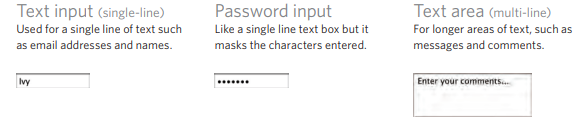
  - Making Choices:
  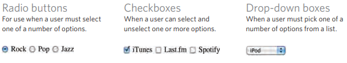
  - Submitting Forms
  - Uploading Files
    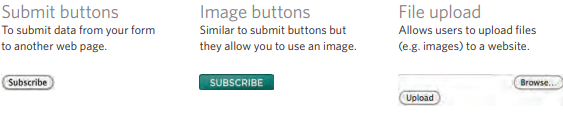

# How Forms Work
* A user fills in a form and then presses a button to submit the information to the server.
* The name of each form control is sent to the server along with the value the user enters or selects.
* The server processes the information using a programming language such as PHP, C#, VB.net, or Java. It may also store the information in a database
* The server creates a new page to send back to the browser based on the information received.
    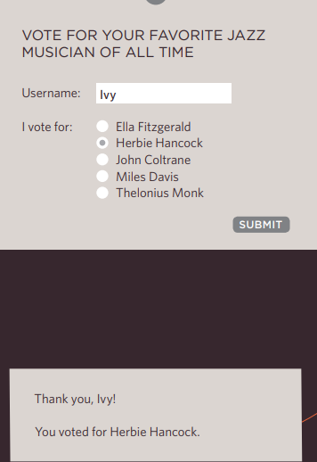

# Form Structure
* < form>
  - Form controls live inside a < form> element. This element should always carry the action attribute and will usually have a method and id attribute too 
*  action
  - Every < form> element requires an action attribute. Its value is the URL for the page on the server that will receive the information in the form when it is submitted.
* method
  - Forms can be sent using one of two methods: get or post.

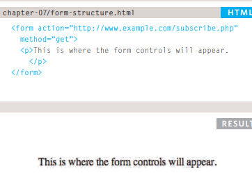

# Text Input
* < input>
  - The < input> element is used to create several different form controls. 
  - The value of the type attribute determines what kind of input they will be creating.
* type="text"
  - When the type attribute has a value of text, it creates a singleline text input.
* name
  - When users enter information into a form, the server needs to know which form control each piece of data was entered into.   
* maxlength
  - You can use the maxlength attribute to limit the number of characters a user may enter into the text field. 
* size
  - The size attribute should not be used on new forms. It was used in older forms to indicate the width of the text input

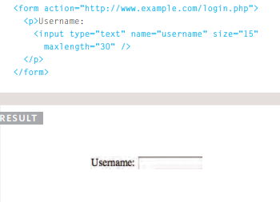

# Password Input
* type="password"
  - When the type attribute has a value of password it creates a text box that acts just like a single-line text input, except the characters are blocked out.
* name
  - The name attribute indicates the name of the password input, which is sent to the server with the password the user enters.
* size, maxlength
  - It can also carry the size and maxlength attributes like the the single-line text input.

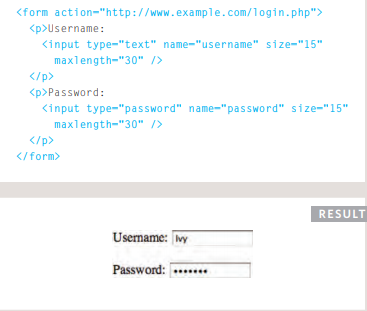

# Text Area
* The < textarea > element is used to create a mutli-line text input. Unlike other input elements this is not an empty element. It should therefore have an opening and a closing tag.
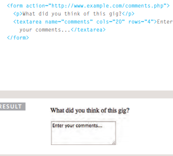

# Radio Button
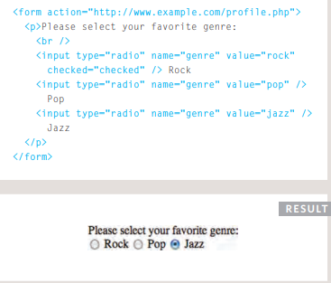

# Checkbox
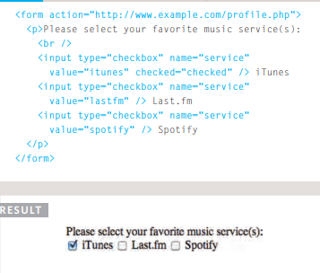

# Drop Down List Box
* < select>
  - A drop down list box (also known as a select box) allows users to select one option from a drop down list. 
* < option>
  - The < option> element is used to specify the options that the user can select from.

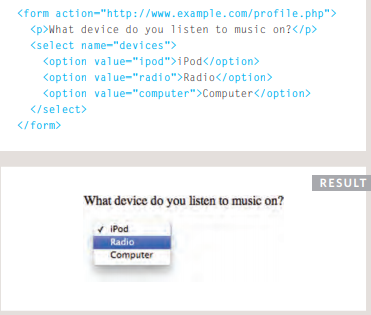

# Multiple Select Box

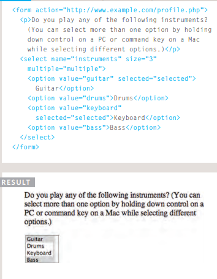

# File Input Box
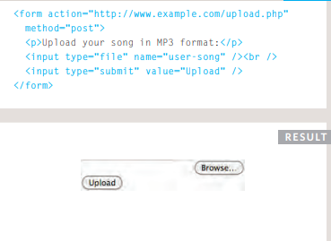

# Submit Button
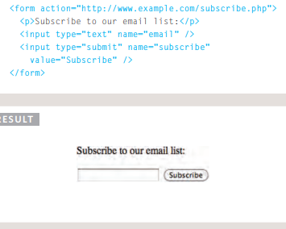

# Image Button
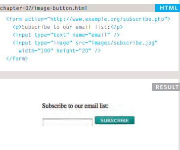

# Button & hidden Controls
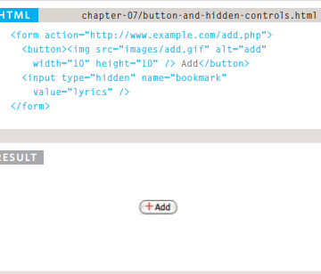

