# Error Handling & Debugging

## ORDER OF EXECUTION 
* To find the source of an error, it helps to know how scripts are processed.
* execution contexts
  -  one global execution context; plus, each function creates a new new execution context. They correspond to variable scope. 
  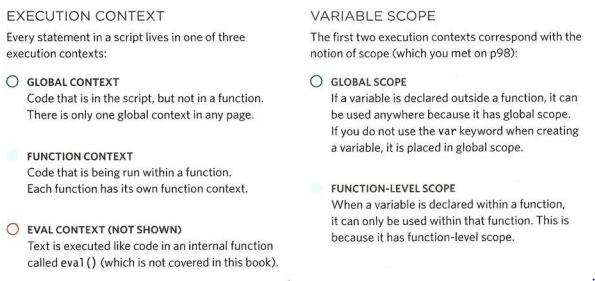

# The stack
* The js interpreter processes one line of code at a time When statement needs data from anather function it stacks the new function on top of the current task
# EXECUTION CONTEXT & HOISTING
  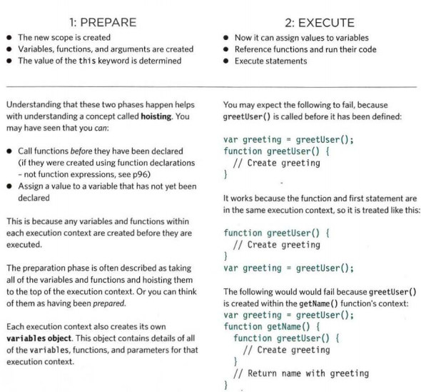

# ERROR OBJECTS 
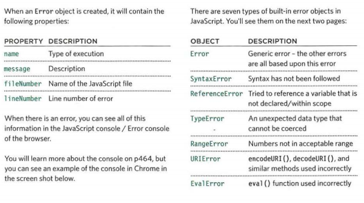

# ERROR OBJECTS CONTINUED

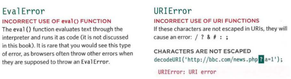
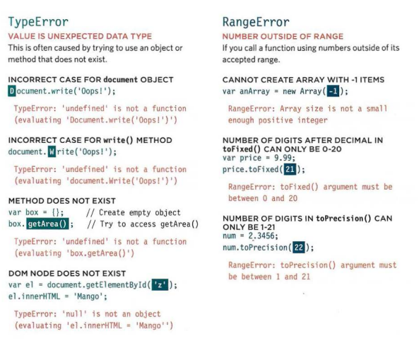
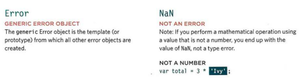

# A DEBUGGING WORKFLOW
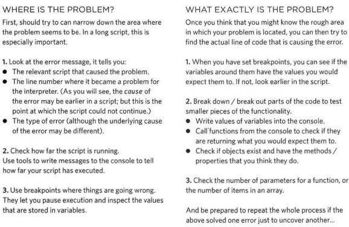

# BROWSER DEV TOOLS & JAVASCRIPT CONSOLE 
* The JavaScript console will tell you when there is a problem with a script, where to look for the problem, and what kind of issue it seems to be. 
* These two pages show instructions for opening the console in all of the main browsers

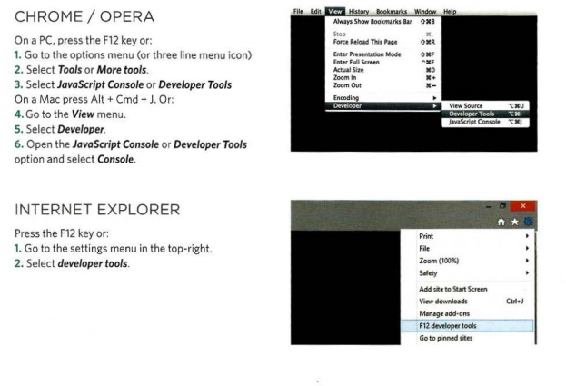
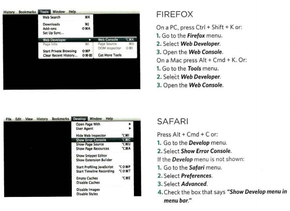

# HOW TO LOOK AT ERRORS IN CHROME 
* The console will show you when there is an error in your JavaScript. It also displays the line where it became a problem for the interpreter
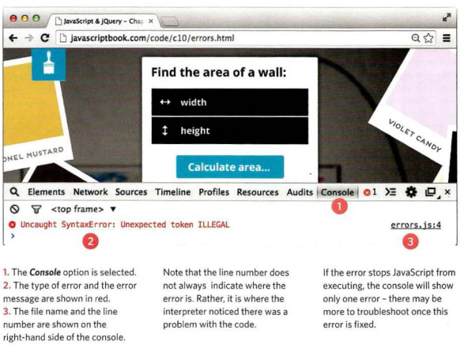

# HOW TO LOOK AT ERRORS IN FIREFOX
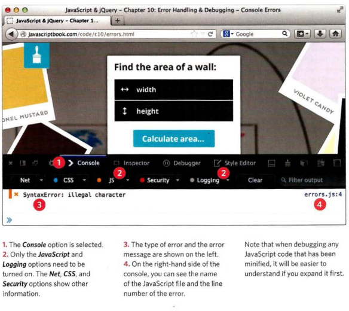

# TYPING IN THE CONSOLE IN CHROME 
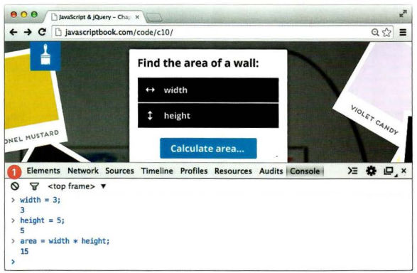

# HANDLING EXCEPTIONS
* If you know your code might fail, use try, catch, and finally. Each one is given its own code block. 
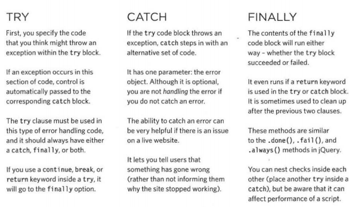

# DEBUGGING TIPS 
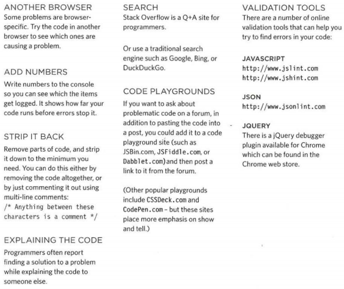

