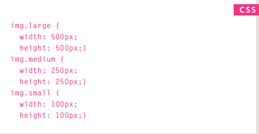
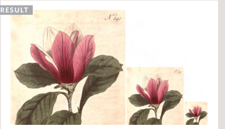
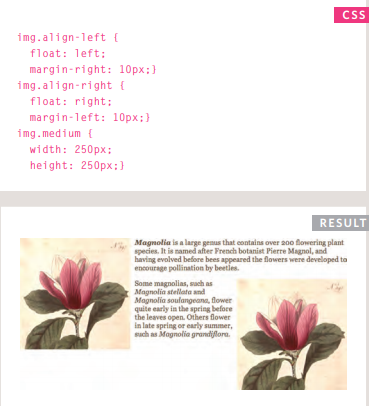
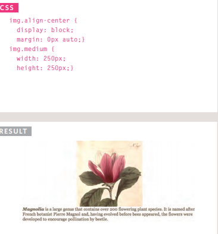
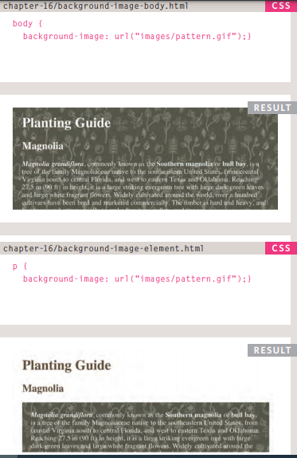
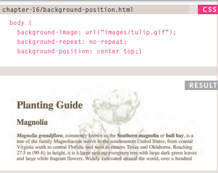
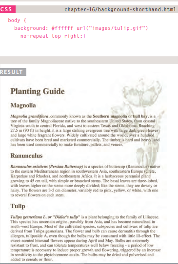
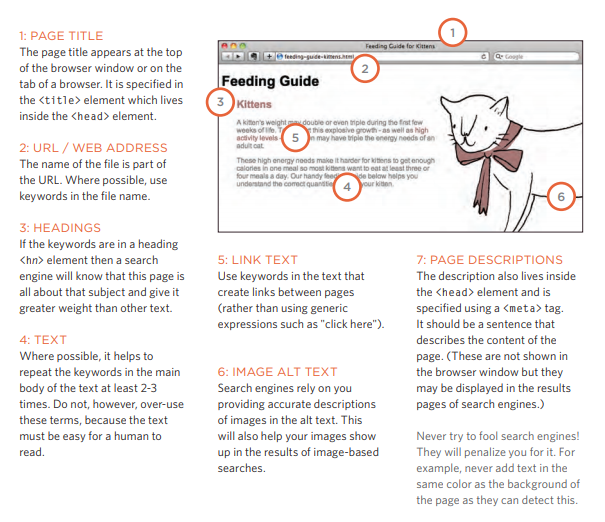

# Images
## Controlling sizes of images in CSS
* You can control the size of an image using the width and height properties in CSS

## AligNing images Using CSS
* Rather than using the < img> element's align attribute, web page authors are increasingly using the float property to align images. There are two ways that this is commonly achieved:
  - The float property is added to the class that was created to represent the size of the image
  - New classes are created with names such as align-left or align-right to align the images to the left or right of the page. These class names are used in addition to classes that indicate the size of the image

## Centering images Using CSS
* there are two common ways in which you can horizontally center an image:
  - On the containing element, you can use the text-align property with a value of center.
  - On the image itself, you can use the use the margin property and set the values of the left and right margins to auto.

## Background Images

## Repeating Images
* The background-repeat property can have four values:
  - repeat
    - The background image is repeated both horizontally and vertically (the default way it is shown if the backgroundrepeat property isn't used).
  - repeat-x
    - The image is repeated horizontally only (as shown in the first example on the left).
  - repeat-y
    - The image is repeated vertically only.
  - no-repeat
    - The image is only shown once.
* The background-attachment property specifies whether a background image should stay in one position or move as the user scrolls up and down the page. It can have one of two values:
  - fixed
    - The background image stays in the same position on the page.
  - scroll
    - The background image moves up and down as the user scrolls up and down the page.

## Background Position

## shorthand
* The properties must be specified in the following order, but you can miss any value if you do not want to specify it.
  - background-color
  - background-image
  - background-repeat
  - background-attachment
  - background-position

# Practical Information

## How Many People Are Coming to Your Site?

