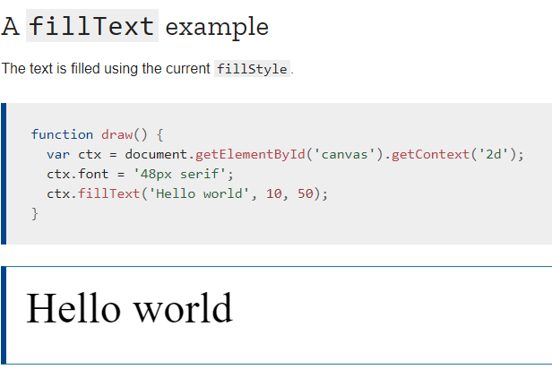

# Charts 
* better for displaying data visually than tables and have the added benefit that no one is ever going to press-gang them into use as a layout tool. They’re easier to look at and convey data quickly, but they’re not always easy to create.
*  great way to get started with charts is with Chart.js
* JavaScript plugin that uses HTML5’s canvas element to draw the graph onto the page.
* It’s a well documented plugin that makes using all kinds of bar charts, line charts, pie charts and more, incredibly easy.

## Setting up
* The first thing we need to do is download Chart.js.
* Copy the Chart.min.js out of the unzipped folder and into the directory you’ll be working in. 
* Then create a new html page and import the script:

## Drawing a line chart
* create a canvas element in our HTML in which Chart.js can draw our chart. 
* So add this to the body of our HTML page:

* Next, we need to write a script that will retrieve the context of the canvas, so add this to the foot of your body element:

* Inside the same script tags we need to create our data, in this instance it’s an object that contains labels for the base of our chart and datasets to describe the values on the chart. Add this immediately above the line that begins ‘var buyers=’:

## Drawing a pie chart
* Our line chart is complete, so let’s move on to our pie chart. First, we need the canvas element:

* Next, we need to get the context and to instantiate the chart:

**we are going to supply some options to the chart.**

* Next we need to create the data. This data is a little different to the line chart because the pie chart is simpler, we just need to supply a value and a color for each section:

* immediately after the pieData we’ll add our options:

## Drawing a bar chart
* add  a bar chart to our page

* retrieve the element and create the graph:

* we add in the bar chart’s data:

* As you can see, the data is largely the same, except this time we’ve chosen to use RGBA to specify our colors which allows us to add transparency.

# Basic usage of canvas

## The < canvas > element

*  < canvas> looks like the < img> element, with the only clear difference being that it doesn't have the src and alt attributes. 
* Indeed, the < canvas> element has only two attributes, width and height
* When no width and height attributes are specified, the canvas will initially be 300 pixels wide and 150 pixels high.
* can be styled just like any normal image

## Fallback content
* The < canvas> element differs from an < img> tag in that, like for < video>, < audio>, or < picture> elements
* it is easy to define some fallback content, to be displayed in older browsers not supporting it.
* Providing fallback content is very straightforward: just insert the alternate content inside the < canvas> element.
* For example, we could provide a text description of the canvas content or provide a static image of the dynamically rendered content. This can look something like this:

## A skeleton template

# Applying styles and colors
##  Colors
* Up until now we have only seen methods of the drawing context. If we want to apply colors to a shape, there are two important properties we can use: fillStyle and strokeStyle.
* fillStyle = color
  - Sets the style used when filling shapes.
* strokeStyle = color
  - Sets the style for shapes' outlines.

# Drawing text
## The canvas rendering context provides two methods to render text:
* fillText(text, x, y [, maxWidth])
  - Fills a given text at the given (x,y) position. Optionally with a maximum width to draw.
* strokeText(text, x, y [, maxWidth])
  - Strokes a given text at the given (x,y) position. Optionally with a maximum width to draw.

