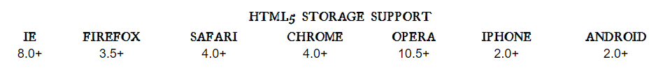
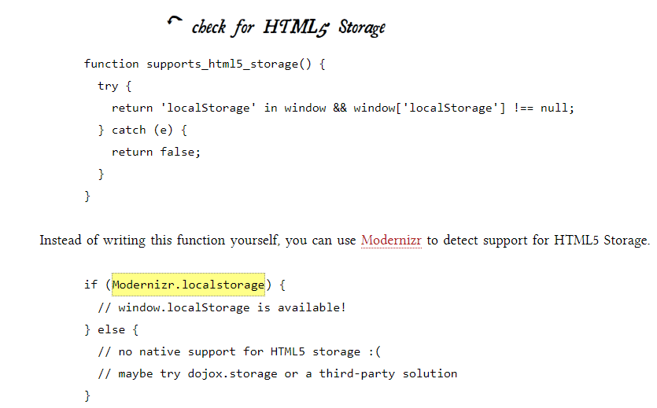
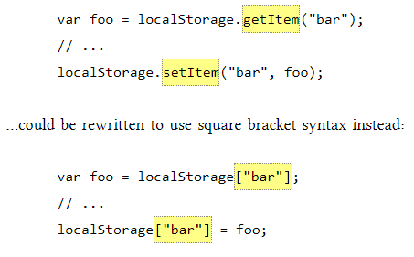
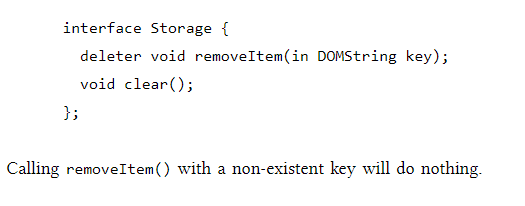
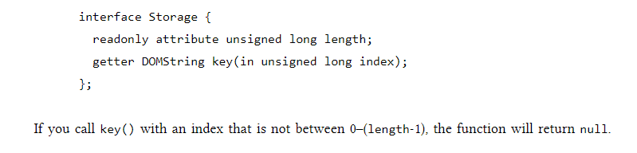
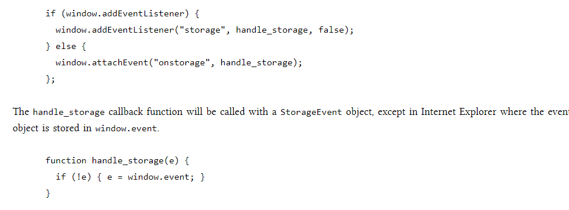
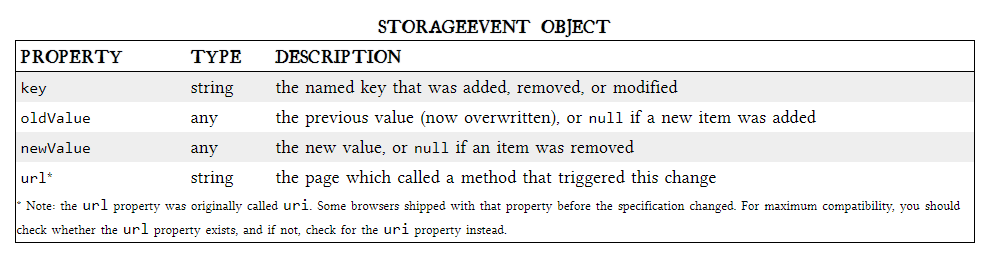
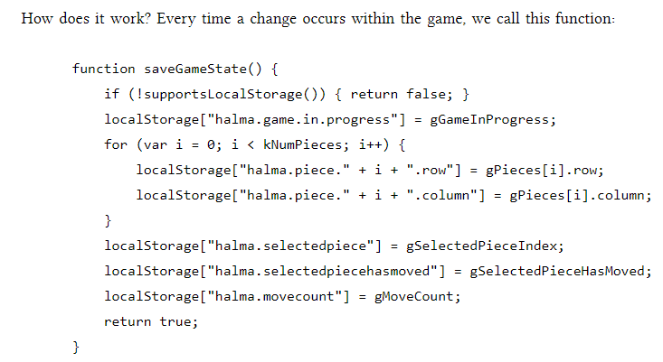
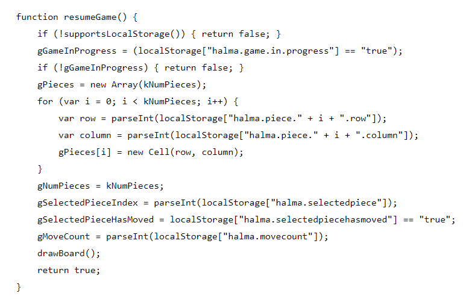
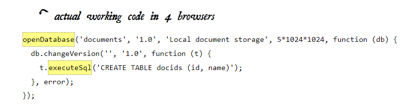

# THE PAST, PRESENT & FUTURE OF LOCAL STORAGE FOR WEB APPLICATIONS
## Persistent local storage
* one of the areas where native client applications have held an advantage over web applications
* For native applications, the operating system typically provides an abstraction layer for storing and retrieving application-specific data like preferences or runtime state.
* These values may be stored in the registry, INI files, XML files, or some other place according to platform convention.

## A BRIEF HISTORY OF LOCAL STORAGE HACKS BEFORE HTML5
* userData allows web pages to store up to 64 KB of data per domain, in a hierarchical XML-based structure. 
* IE does not present any form of permissions dialog, and there is no allowance for increasing the amount of storage available.
* Within the Flash environment, the feature is properly known as Local Shared Objects. Briefly, it allows Flash objects to store up to 100 KB of data per domain.
*  Brad Neuberg developed an early prototype of a Flash-to-JavaScript bridge called AMASS (AJAX Massive Storage System), but it was limited by some of Flash’s design quirks.
* with the advent of ExternalInterface in Flash 8, accessing LSOs from JavaScript became an order of magnitude easier and faster. Brad rewrote AMASS and integrated it into the popular Dojo Toolkit under the moniker dojox.storage.
* Flash gives each domain 100 KB of storage “for free.” Beyond that, it prompts the user for each order of magnitude increase in data storage (1 Mb, 10 Mb, and so on).
* In 2007, Google launched Gears, an open source browser plugin aimed at providing additional capabilities in browsers.
* Gears provides an API to an embedded SQL database based on SQLite. After obtaining permission from the user once, Gears can store unlimited amounts of data per domain in SQL database tables.
* HTML5 set out to solve: to provide a standardized API, implemented natively and consistently in multiple browsers, without having to rely on third-party plugins.

## INTRODUCING HTML5 STORAGE
* “HTML5 Storage” is a specification named Web Storage, which was at one time part of the HTML5 specification proper, but was split out into its own specification
* what is HTML5 Storage? 
  - it’s a way for web pages to store named key/value pairs locally, within the client web browser. Like cookies, this data persists even after you navigate away from the web site, close your browser tab, exit your browser, or what have you. 

* From your JavaScript code, you’ll access HTML5 Storage through the localStorage object on the global window object. Before you can use it, you should detect whether the browser supports it.

## USING HTML5 STORAGE
* HTML5 Storage is based on named key/value pairs. 
* You store data based on a named key, then you can retrieve that data with the same key. 
* The named key is a string. The data can be any type supported by JavaScript, including strings, Booleans, integers, or floats. 
* the data is actually stored as a string. 
* If you are storing and retrieving anything other than strings, you will need to use functions like parseInt() or parseFloat() to coerce your retrieved data into the expected JavaScript datatype.
* Calling setItem() with a named key that already exists will silently overwrite the previous value. Calling getItem() with a non-existent key will return null rather than throw an exception.

* Like other JavaScript objects, you can treat the localStorage object as an associative array. Instead of using the getItem() and setItem() methods, you can simply use square brackets. For example, this snippet of code:

* There are also methods for removing the value for a given named key, and clearing the entire storage area (that is, deleting all the keys and values at once).

* Finally, there is a property to get the total number of values in the storage area, and to iterate through all of the keys by index (to get the name of each key).

## TRACKING CHANGES TO THE HTML5 STORAGE AREA
* If you want to keep track programmatically of when the storage area changes, you can trap the storage event. The storage event is fired on the window object whenever setItem(), removeItem(), or clear() is called and actually changes something.
* The storage event is supported everywhere the localStorage object is supported, which includes Internet Explorer 8. IE 8 does not support the W3C standard addEventListener

## HTML5 STORAGE IN ACTION
* with HTML5 Storage, we can save the progress locally, within the browser itself. Here is a live demonstration. Make a few moves, then close the browser tab, then re-open it. 
* If your browser supports HTML5 Storage, the demonstration page should magically remember your exact position within the game, including the number of moves you’ve made, the position of each of the pieces on the board, and even whether a particular piece is selected.

* On page load, instead of automatically calling a newGame() function that would reset these variables to hard-coded values, we call a resumeGame() function instead. Using HTML5 Storage, the resumeGame() function checks whether a state about a game-in-progress is stored locally. If so, it restores those values using the localStorage object

## BEYOND NAMED KEY-VALUE PAIRS: COMPETING VISIONS

