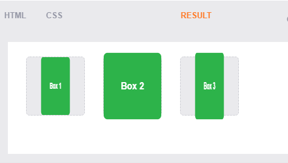

#  Build the Perfect Team
* For a healthy work environment there should be equal division so that everyone can speak the same amount
* There must be a social sensitivity to the feelings of others
In this way, the business will flourish and the team will succeed
________________
# Transforms
*  comes in two different settings, two-dimensional and three-dimensional. Each of these come with their own individual properties and values.

## Transform Syntax#transform-syntax

## 2D Transforms
## 2D Rotate

* work on the x and y axes, known as horizontal and vertical axes.
* The rotate value provides the ability to rotate an element from 0 to 360 degrees. 
* Using a positive value will rotate an element clockwise, and using a negative value will rotate the element counterclockwise. 
* The default point of rotation is the center of the element, 50% 50%, both horizontally and vertically. 

## 2D Scale

*  allows you to change the appeared size of an element. 
* The default scale value is 1, therefore any value between .99 and .01 makes an element appear smaller while any value greater than or equal to 1.01 makes an element appear larger.

* The scaleX value will scale the width of an element while the scaleY value will scale the height of an element.
* scale transform declaring the x axis value first, followed by a comma, and then the y axis value.

## 2D Translate
* pushing and pulling an element in different directions without interrupting the normal flow of the document. 
* Using the translateX value will change the position of an element on the horizontal axis while using the translateY value will change the position of an element on the vertical axis.
* Positive values will push an element down and to the right of its default position while negative values will pull an element up and to the left of its default position.

## 2D Skew
* used to distort elements on the horizontal axis, vertical axis, or both.
* skewX value distorts an element on the horizontal axis while the skewY value distorts an element on the vertical axis. 
* To distort an element on both axes the skew value is used, declaring the x axis value first, followed by a comma, and then the y axis value.%p
* The distance calculation of the skew value is measured in units of degrees. Length measurements, such as pixels or percentages, do not apply here.

## Combining Transforms

* multiple transforms to be used at once, rotating and scaling the size of an element at the same time for example. 
* Using multiple transform declarations will not work, as each declaration will overwrite the one above it. The behavior in that case would be the same as if you were to set the height of an element numerous times.

## 2D Cube Demo

## Transform Origin
* 

