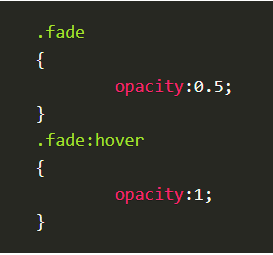
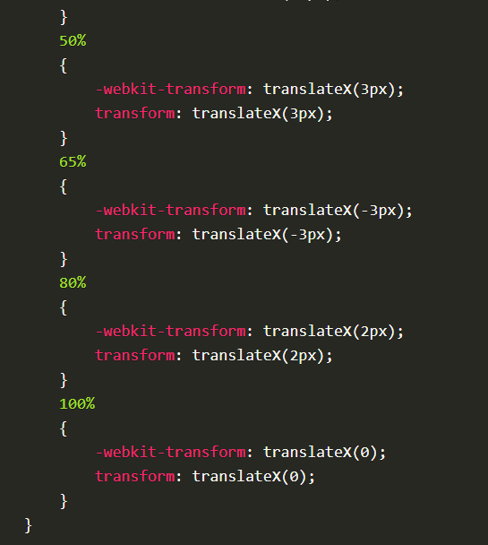

#  Build the Perfect Team
* For a healthy work environment there should be equal division so that everyone can speak the same amount
* There must be a social sensitivity to the feelings of others
In this way, the business will flourish and the team will succeed
________________
# Transforms
*  comes in two different settings, two-dimensional and three-dimensional. Each of these come with their own individual properties and values.

## Transform Syntax#transform-syntax

## 2D Transforms
## 2D Rotate

* work on the x and y axes, known as horizontal and vertical axes.
* The rotate value provides the ability to rotate an element from 0 to 360 degrees. 
* Using a positive value will rotate an element clockwise, and using a negative value will rotate the element counterclockwise. 
* The default point of rotation is the center of the element, 50% 50%, both horizontally and vertically. 

## 2D Scale

*  allows you to change the appeared size of an element. 
* The default scale value is 1, therefore any value between .99 and .01 makes an element appear smaller while any value greater than or equal to 1.01 makes an element appear larger.

* The scaleX value will scale the width of an element while the scaleY value will scale the height of an element.
* scale transform declaring the x axis value first, followed by a comma, and then the y axis value.

## 2D Translate
* pushing and pulling an element in different directions without interrupting the normal flow of the document. 
* Using the translateX value will change the position of an element on the horizontal axis while using the translateY value will change the position of an element on the vertical axis.
* Positive values will push an element down and to the right of its default position while negative values will pull an element up and to the left of its default position.

## 2D Skew
* used to distort elements on the horizontal axis, vertical axis, or both.
* skewX value distorts an element on the horizontal axis while the skewY value distorts an element on the vertical axis. 
* To distort an element on both axes the skew value is used, declaring the x axis value first, followed by a comma, and then the y axis value.%p
* The distance calculation of the skew value is measured in units of degrees. Length measurements, such as pixels or percentages, do not apply here.

## Combining Transforms

* multiple transforms to be used at once, rotating and scaling the size of an element at the same time for example. 
* Using multiple transform declarations will not work, as each declaration will overwrite the one above it. The behavior in that case would be the same as if you were to set the height of an element numerous times.

## 2D Cube Demo

## Transform Origin
* dead center of an element, both 50% horizontally and 50% vertically. 
* can accept one or two values. When only one value is specified, that value is used for both the horizontal and vertical axes. If two values are specified, the first is used for the horizontal axis and the second is used for the vertical axis.

## Perspective
* The perspective of an element can be set in two different ways. One way includes using the perspective value within the transform property on individual elements, while the other includes using the perspective property on the parent element residing over child elements being transformed

## Perspective Depth Value

## Perspective Origin
*  used with the perspective-origin property, and maintain the same relationship to the element. The large difference between the two falls where the origin of a transform determines the coordinates used to calculate the change of a transform, while the origin of a perspective identifies the coordinates of the vanishing point of a transform

# 3D Transforms
## 3D Rotate
* can rotate an element around any axes. To do so, we use three new transform values, including rotateX, rotateY, and rotateZ.

## 3D Scale

## 3D Translate

## Transform Style

## Backface Visibility

# 8 SIMPLE CSS3 TRANSITIONS THAT WILL WOW YOUR USERS

## 1. Fade in
* Having things fade in is a fairly common request from clients. It’s a great way to emphasize functionality or draw attention to a call to action.

* Fade in effects are coded in two steps: first, you set the initial state; next, you set the change, for example on hover:

## 2. Change color

## 3. Grow & Shrink
* To grow an element, you used to have to use its width and height, or its padding. But now we can use CSS3’s transform to enlarge.

* Shrinking an element is as simple as growing it. To enlarge an element we specify a value greater than 1, to shrink it, we specify a value less than 1:

## 4. Rotate elements
* Give your div the class “rotate” and add the following to your CSS:

## 5. Square to circle
* A really popular effect at the moment is transitioning a square element into a round one, and vice versa. With CSS, it’s a simple effect to achieve, we just transition the border-radius property.

* Give your div the class “circle” and add this CSS to your styles:

## 6. 3D shadow
* This effect is achieved by adding a box shadow, and then moving the element on the x axis using the transform and translate properties so that it appears to grow out of the screen.

* Give your div the class “threed” and then add the following code to your CSS:

## 7. Swing
* In this case, we’ll first define a CSS animation in your styles. You’ll notice that due to implementation issues, we need to use @-webkit-keyframes as well as @keyframes

* This animation simply moves the element left and right, now all we need to do is apply it:

## 8. Inset border
* Give your div the class “border” and add the following CSS to your styles:

