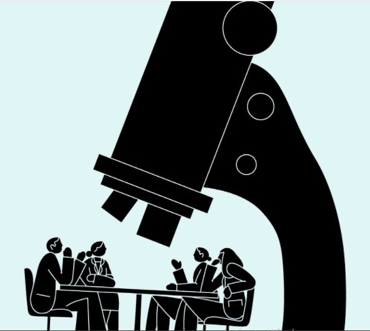
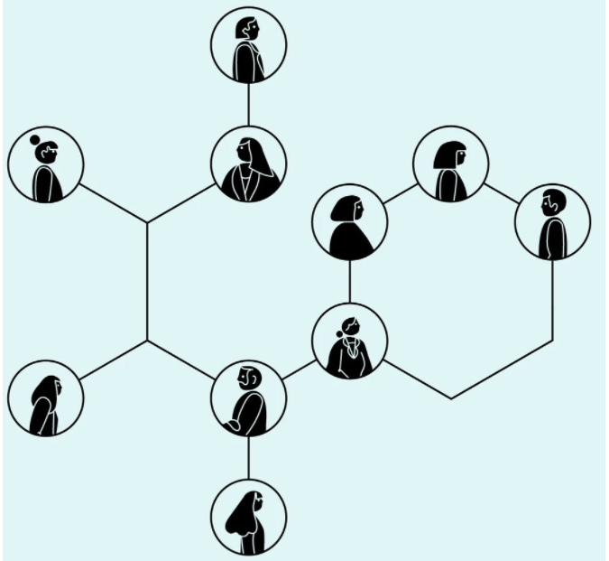
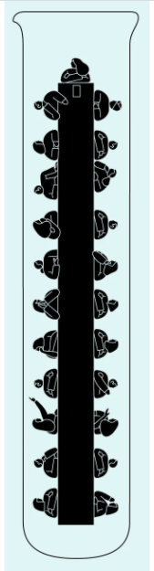

# What Google Learned About Teams

* It was noticed in most cases that there is a difference in the performance of the groups, where there are distinct groups and the rate of completion of work and tasks is high and distinct, and the other part of the groups has a lower rate of achievement despite the presence of distinguished members who have a distinguished scientific background.

* The Google team decided to find out the reasons that lead to the difference in achievement and carry out the tasks entrusted to them in an irregular manner through the collection of data and knowledge of patterns that lead to this

* The Google team created the Aristotle project to study the reasons for the difference to produce successful and effective groups, so they began to study all the groups and collect information about them to know the patterns

* At first, they had difficulty recognizing the similarities between the successful groups, as they found contradictory and different data.

* You may find a group consisting of intelligent individuals who have a distinguished scientific background, but their achievement is less and their group is completely unsuccessful.

* On the contrary, there are groups with normal scientific backgrounds and their members are less intelligent, but they accomplish tasks successfully and are considered one of the distinguished groups

* In the end, you arrive at the following:

  -  to Build the Perfect Team :
    - For a healthy work environment there should be equal division so that everyone can speak the same amount
    - There must be a social sensitivity to the feelings of others
In this way, the business will flourish and the team will succeed

